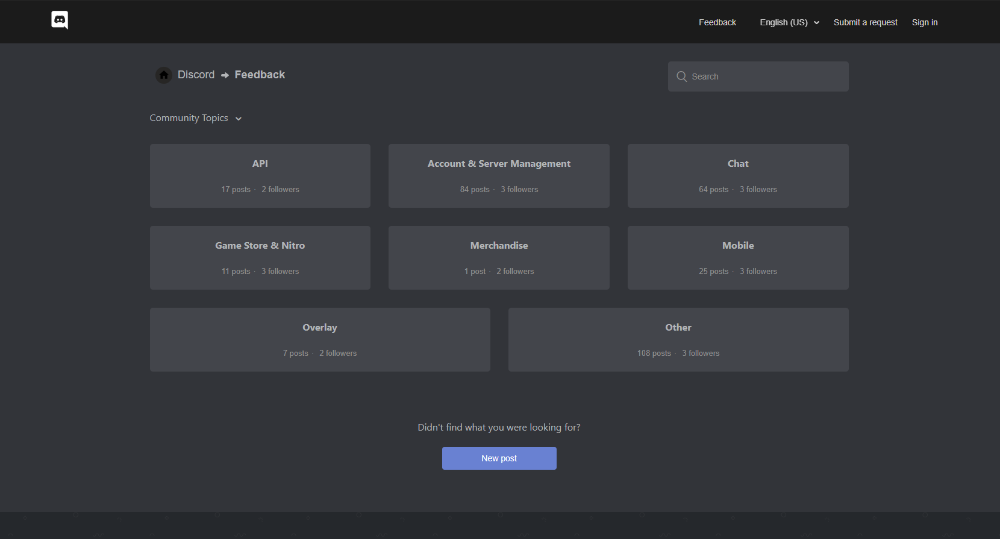
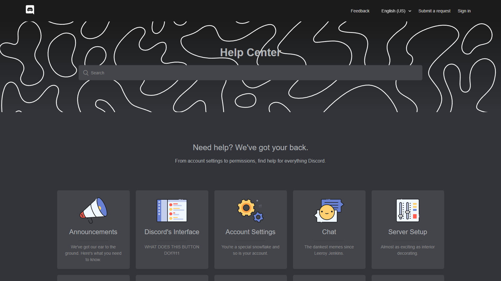

# Discord Zendesk Darkmode 

A dark theme for Discord's Zendesk pages. It's easier on the eyes and generally adheres better to Discord's design principles.  

 

## Initial goal

The goal of this repository is to both merge the [Discord Feedback Dark](https://userstyles.org/styles/165795) & [Discord Support Dark](https://userstyles.org/styles/166961) themes and to move them to a centralized location, this will in turn provide a way for users to more easily modify and share improvements of the themes. This also means that the themes on Userstyles.org will not receive any further updates.

 

## Preview

| Feedback | Support |
|----------|---------|
|  |  |

 

## Installation

Install [Stylus](https://github.com/openstyles/stylus) for either [Firefox](https://addons.mozilla.org/en-US/firefox/addon/styl-us/), [Chrome](https://chrome.google.com/webstore/detail/stylus/clngdbkpkpeebahjckkjfobafhncgmne) or the browser of your choice, then install the desired version using one of the following methods.

#### UserCSS installation:

- Open the UserCSS install version, found below, of the theme you want to install.
- Press the "Install style" button in the upper left corner.

#### Manual installation:

- Open the Stylus extension and click "Manage styles".
- Click "Write new style" and give the style a name.
- Open the manual install version, found below, of the theme you want to install.
- Copy the whole style, `ctrl + A` then `ctrl + C`, then paste it into the newly created Stylus style `ctrl + V` and save it.

### Full theme

💾 [Install UserCSS](https://raw.githubusercontent.com/Thereatra/Discord-Zendesk-Darkmode/master/zendesk-dark.user.css) which supports automatic updates.  
💾 [Install manually](https://raw.githubusercontent.com/Thereatra/Discord-Zendesk-Darkmode/master/zendesk-dark.css) with no support for automatic updates. The style is in Mozilla format.

### Feedback only

💾 [Install UserCSS](https://raw.githubusercontent.com/Thereatra/Discord-Zendesk-Darkmode/master/feedback/feedback-dark.user.css) which supports automatic updates.  
💾 [Install manually](https://raw.githubusercontent.com/Thereatra/Discord-Zendesk-Darkmode/master/feedback/feedback-dark.css) with no support for automatic updates. The style is in Mozilla format.

### Support only

💾 [Install UserCSS](https://raw.githubusercontent.com/Thereatra/Discord-Zendesk-Darkmode/master/support/support-dark.user.css) which supports automatic updates.  
💾 [Install manually](https://raw.githubusercontent.com/Thereatra/Discord-Zendesk-Darkmode/master/support/support-dark.css) with no support for automatic updates. The style is in Mozilla format.

 

## To-do

- [x] Update descriptions on Userstyles.org
- [x] Provide a combined UserCSS version
- [ ] Adhere better to Discord's dark theme design
- [x] Provide installation instructions
- [ ] Add contribution guidelines
- [ ] Convert to less
- [ ] Automate versioning
