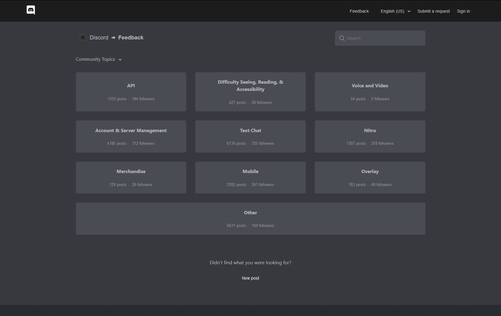

# Discord Zendesk Darkmode 

A dark theme for Discord's Zendesk pages. It is easier on the eyes and generally adheres better to Discord's design principles.

This repository started out as a merge of the [Discord Feedback Dark](https://userstyles.org/styles/165795) and [Discord Support Dark](https://userstyles.org/styles/166961) themes. This also means that those themes will not receive any updates.  
Additionally, this move provides a way for users to more easily modify and share improvements for the theme.

## Preview

| Feedback                                                 | Support                                                |
|----------------------------------------------------------|--------------------------------------------------------|
|  |  |

## Installation

Install [Stylus](https://github.com/openstyles/stylus) for either [Firefox](https://addons.mozilla.org/firefox/addon/styl-us/), [Chrome](https://chrome.google.com/webstore/detail/stylus/clngdbkpkpeebahjckkjfobafhncgmne) or the browser of your choice, then install the desired theme version using one of the following methods.

### UserCSS installation

1. Open the UserCSS version of the theme you want to install.
2. Click the `Install style` button in the upper left corner.

### Manual installation

1. Open the Stylus extension and click the `Manage` button.
2. Click the `Write new style` button and give the style a name.
3. Open the manual version of the theme you want to install.
4. Copy the whole style then paste it into the newly created Stylus style and save it.

## Theme versions

### Full theme

💾 [Install UserCSS](https://raw.githubusercontent.com/Thereatra/Discord-Zendesk-Darkmode/master/zendesk-dark.user.css) which supports automatic updates.  
💾 [Install manually](https://raw.githubusercontent.com/Thereatra/Discord-Zendesk-Darkmode/master/zendesk-dark.css) with no support for automatic updates. The style is in Mozilla format.

### Feedback only

💾 [Install UserCSS](https://raw.githubusercontent.com/Thereatra/Discord-Zendesk-Darkmode/master/feedback/feedback-dark.user.css) which supports automatic updates.  
💾 [Install manually](https://raw.githubusercontent.com/Thereatra/Discord-Zendesk-Darkmode/master/feedback/feedback-dark.css) with no support for automatic updates. The style is in Mozilla format.

### Support only

[💾 Install UserCSS](https://raw.githubusercontent.com/Thereatra/Discord-Zendesk-Darkmode/master/support/support-dark.user.css) which supports automatic updates.  
💾 [Install manually](https://raw.githubusercontent.com/Thereatra/Discord-Zendesk-Darkmode/master/support/support-dark.css) with no support for automatic updates. The style is in Mozilla format.

## To-do

- [x] Add CSS linting
- [x] Versioning
- [ ] Add contribution guidelines
- [x] Automatic generation of UserCSS versions
